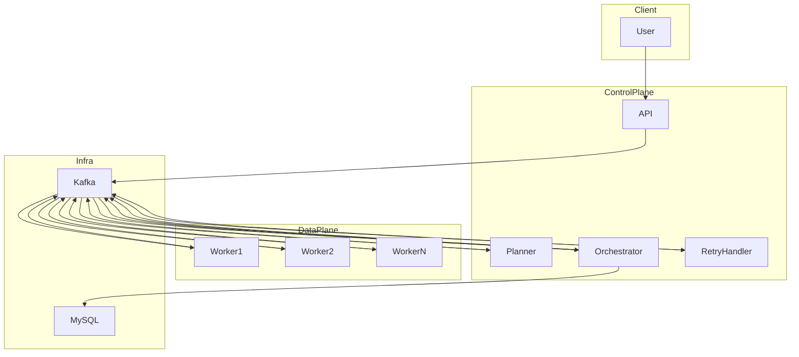

# AI DAG Orchestrator

A distributed **DAG orchestration system** built with **Go + Kafka + MySQL**.

The system converts a user request into a DAG execution plan and orchestrates distributed workers to execute nodes with dependency scheduling.

It demonstrates the architecture of an **event-driven workflow engine** similar to **Airflow / Argo Workflows / Temporal**, simplified for learning and experimentation.

---

# Highlights

- Event-driven DAG orchestration built on **Kafka**
- **LLM-powered DAG planner** with strict JSON schema validation
- **Idempotent worker execution** using attempt gating
- **Retry + Dead Letter Queue (DLQ)** workflow for fault tolerance
- **Server-Sent Events (SSE)** for real-time job progress streaming
- **Prometheus metrics** for observability
- **Graphviz DAG visualization** via DOT export

---

# Architecture



The system is divided into two logical layers:

### Control Plane

Responsible for planning, scheduling and state management.

Components:

- API
- Planner
- Orchestrator
- RetryHandler

### Data Plane

Responsible for executing actual tasks.
Components:

- Worker processes executing DAG operators.
  Infrastructure:
- Kafka — event bus
- MySQL — state storage

## Event Flow

Pipeline flow:

```text
submit → plan → dispatch → execute → status → persist → query
```

Kafka topics:

```text
dag.job.submit API -> Planner
dag.plan.result Planner -> Orchestrator
dag.node.dispatch Orchestrator -> Worker
dag.node.status Worker -> Orchestrator
dag.node.retry Orchestrator -> RetryHandler
dag.node.dlq Orchestrator -> DLQ
```

## Components:

### API Service

Responsibilities:

- Accept user requests
- Publish dag.job.submit
- Query job status
- Stream execution progress via SSE

Endpoints:

```http
POST /submit
GET /jobs/{job_id}
GET /jobs/{job_id}/events
GET /jobs/{job_id}/dag.dot
```

`GET /jobs/{job_id}` includes:

- `job.parent_job_id`: parent job id for child replan jobs
- `job.replanned_to_job_id`: child job id created by replan (if any)

### Planner

- Consumes `dag.job.submit`
- Generates DAG plan
- Publishes `dag.plan.result`

### Orchestrator

Core DAG scheduling engine.

Responsibilities:

- Persist DAG structure into MySQL
- Calculate node dependency indegree
- Dispatch runnable nodes
- Unlock downstream nodes
- Trigger retry / DLQ logic

### Worker

Responsibilities:

- Execute DAG operators
- Report node execution status
- Produce artifacts

Example operators:

- download
- transform_upper
- upload_local

---

## DAG Example

User request:

```txt
make hello world pipeline
```

Generated DAG:

```txt
download -> transform_upper -> upload
```

Execution result:

```txt
hello world -> HELLO WORLD -> artifact file
```

---

# Reliability Features

The system implements several reliability mechanisms used in distributed workflow engines.

## Idempotent Execution

Workers use attempt gating to prevent duplicate execution.

```sql
INSERT IGNORE INTO node_attempts(job_id,node_id,attempt)
```

Only the worker that successfully inserts the row executes the node.

## This protects against duplicate Kafka message delivery.

## Idempotent Dependency Unlock

Downstream node scheduling uses a deduplication table.

`node_edge_unlocks`

Each edge (`from_node`, `to_node`) can unlock downstream only once.

This prevents double decrement of `indegree_remaining`.

## Retry + DLQ

Failed nodes are retried with backoff.

```txt
FAILED
↓
dag.node.retry
↓
retryhandler delay
↓
dag.node.dispatch
```

If retries exceed `NODE_MAX_RETRY`:

```txt
dag.node.dlq
job → FAILED
```

## Parent/Child Replan

When a node reaches terminal failure after max retries, orchestrator triggers a child replan job.

Parent job status transition:

```txt
RUNNING -> NEEDS_REPLAN -> REPLANNED
```

If child replan submit fails, parent falls back to terminal failure:

```txt
RUNNING -> NEEDS_REPLAN -> FAILED
```

API fields related to this flow:

- `job.parent_job_id`
- `job.replanned_to_job_id`

## Observability

The system exposes Prometheus metrics.

Metrics endpoint:

```txt
/metrics
```

Planner metrics:

- planner_llm_latency_ms
- planner_plan_total
- planner_repair_rounds_total

Orchestrator metrics:

- orchestrator_dispatch_total
- orchestrator_queue_lag_ms

Worker metrics:

- worker_node_total
- worker_retry_total
- worker_op_duration_ms

## Streaming Job Progress (SSE)

Real-time job progress streaming.

Endpoint:

```http
GET /jobs/{job_id}/events
```

Example event:

```json
event: node_event
data: {
"node_id": "upper",
"status": "SUCCEEDED",
"attempt": 1
}
```

Events are streamed from the node_events table.

## DAG Visualization

The system can export the execution graph in Graphviz DOT format.

```http
GET /jobs/{job_id}/dag.dot
```

Example:

```json
digraph DAG {
node_1 [label="node_1\n(download)"];
node_2 [label="node_2\n(transform_upper)"];
node_3 [label="node_3\n(upload_local)"];
node_1 -> node_2;
node_2 -> node_3;
}
```

The DOT output can be rendered using Graphviz or any online Graphviz viewer.

## Quick Start

### 1 Start infrastructure

```bash
docker-compose up -d
```

This starts:

- Kafka
- MySQL
- Zookeeper

### 2 Run services

Open five terminals.

#### Terminal A — Orchestrator

```powershell
$env:MYSQL_DSN="root:root@tcp(localhost:3307)/dag?parseTime=true&multiStatements=true"
$env:KAFKA_BROKERS="localhost:9092"
$env:METRICS_ADDR=":9102"
go run ./cmd/orchestrator
```

#### Terminal B — Planner

```powershell
$env:MYSQL_DSN="root:root@tcp(localhost:3307)/dag?parseTime=true&multiStatements=true";
$env:KAFKA_BROKERS="localhost:9092"
$env:METRICS_ADDR=":9101"
$env:LLM_PROVIDER="compatible"
$env:LLM_BASE_URL="https://dashscope.aliyuncs.com/compatible-mode/v1"
$env:OPENAI_API_KEY="xxx"
$env:OPENAI_MODEL="qwen3.5-plus"

go run ./cmd/planner
```

#### Terminal C — Worker

```powershell
$env:MYSQL_DSN="root:root@tcp(localhost:3307)/dag?parseTime=true&multiStatements=true"
$env:KAFKA_BROKERS="localhost:9092"
$env:METRICS_ADDR=":9103"
$env:DATA_DIR="./data"
go run ./cmd/worker
```

#### Terminal D — API

```powershell
$env:MYSQL_DSN="root:root@tcp(localhost:3307)/dag?parseTime=true&multiStatements=true"
$env:KAFKA_BROKERS="localhost:9092"
$env:METRICS_ADDR=":9100"
$env:HTTP_ADDR=":8080"
go run ./cmd/api
```

#### Terminal E — Retryhandler

```powershell
$env:MYSQL_DSN="root:root@tcp(localhost:3307)/dag?parseTime=true&multiStatements=true"
$env:KAFKA_BROKERS="localhost:9092"
$env:METRICS_ADDR=":9104"
go run ./cmd/retryhandler
```

## Verification (Smoke Tests)

#### POST /submit

PowerShell example:

```powershell
Invoke-RestMethod -Method Post `
-Uri "http://localhost:8080/submit" `
-ContentType "application/json" `
-Body '{"user_request":"make hello world pipeline"}'
```

Query job status:
curl http://localhost:8080/jobs/<job_id>

Example response:

```bash
{
"job": {
"job_id": "job_4c4ec031-09d4-4043-b5da-f280ca4a7aaf",
"status": "SUCCEEDED"
},
"nodes": [
{
"node_id": "download",
"status": "SUCCEEDED",
"output_text": "hello world"
},
{
"node_id": "upper",
"status": "SUCCEEDED",
"output_text": "HELLO WORLD"
},
{
"node_id": "upload",
"status": "SUCCEEDED",
"artifact_uri": "file://data/out/job_xxx.txt"
}
]
}
```
